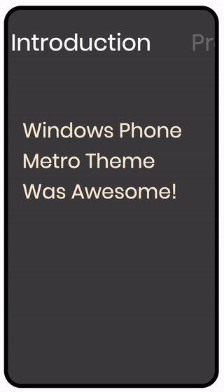

# React Metro Tabs

windows phone style tabs in react.js

## Install

```bash
npm install --save react-metro-tabs
```

```bash
yarn add react-metro-tabs
```

## demo



## Example Usage

[Sandbox](https://codesandbox.io/s/strange-butterfly-hu80m2?from-embed)

```jsx
import React, { Component } from "react";

import { MetroTabs, MetroTab } from "react-metro-tabs";

export default function App() {
  return (
    <div
      style={{
        border: "2px solid black",
        borderRadius: 10,
        height: 500,
        width: 300,
      }}
    >
      <MetroTabs onTabChange={(e) => console.log(e)} tabSpaces={50}>
        <MetroTab title='landing page'>content1</MetroTab>
        <MetroTab title='study cases'>content2</MetroTab>
        <MetroTab title='contact us'>content3</MetroTab>
      </MetroTabs>
    </div>
  );
}
```

## MetroTabs props

| Prop                     | Type     | Description                                               | Default  |
| ------------------------ | -------- | --------------------------------------------------------- | -------- |
| transitionDuration       | number   | transition duration                                       | 1000     |
| tabSpaces                | number   | space between tabs, make it dynamic for making responsive | 70       |
| tabsColor                | string   | color of all tabs                                         | "#000"   |
| tabFontSize              | number   | font size of all tabs                                     | "2.5em"  |
| tabFontWeight            | number   | font weight of all tabs                                   | "normal" |
| transitionTimingFunction | string   | transition timing function                                | "ease"   |
| onTabChange              | Function | function that triggers on tab change                      |          |
| children                 | Node     | children (only MetroTab is allowed)                       |          |

## MetroTab props

| Prop     | Type   | Description                           | Default |
| -------- | ------ | ------------------------------------- | ------- |
| title    | string | title of the tab                      |         |
| children | Node   | children (every children are allowed) |         |

## License

The source code is licensed under MIT, all assets are copyrighted to their respective owner.

This package uses react-hammerjs underhood.
